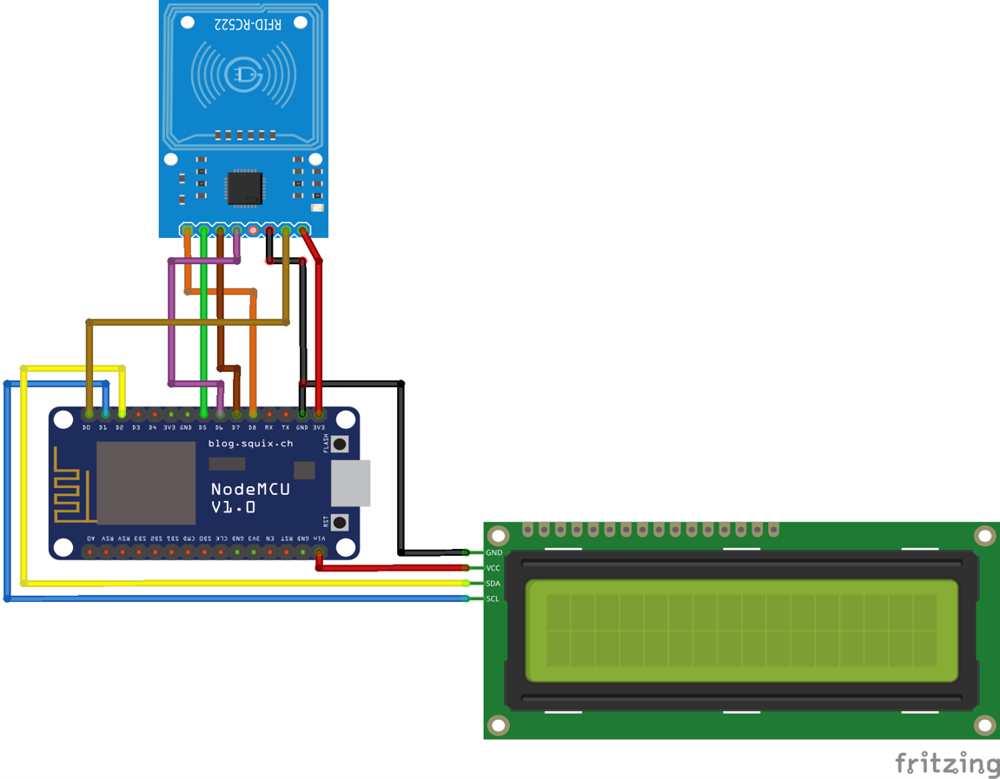

# Smart Attendance Core

## Wiring


## Getting started

1. Clone the repo
2. Install [PlatformIO](https://platformio.org/)
3. Create a file named `AZURE_CRED.h` like follows and place it in the `include` directory :
 ```
#define IOT_CONFIG_IOTHUB_FQDN "<IOT_CONFIG_IOTHUB_FQDN>"
#define IOT_CONFIG_DEVICE_ID "<IOT_CONFIG_DEVICE_ID>"
#define IOT_CONFIG_DEVICE_KEY "<IOT_CONFIG_DEVICE_KEY>" 
 ```   
4. Build and upload ! 